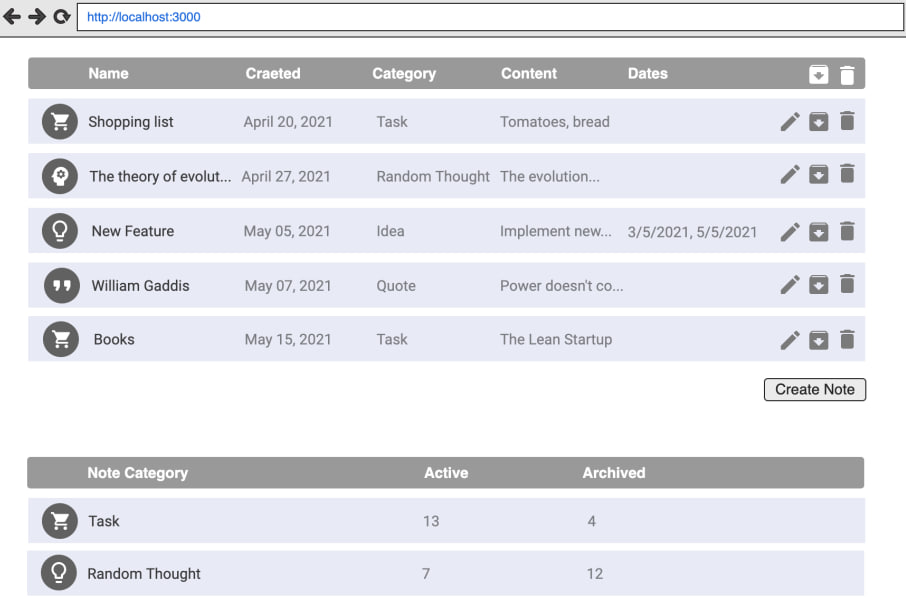

# NotesApp_Task1_Radency

https://64cbfb37dad64a006e2bab9d--incomparable-bubblegum-d7abdd.netlify.app/

Hometask #1 | JavaScript
1. Your task is to create a notes app in JS as a web app. Users can add, edit and remove
   notes.
2. List of notes is displayed in a form of table (HTML representation may vary: table, divs
   etc). The columns are time of creation, note content, note category. Categories are
   predefined: “Task”, “Random Thought”, “Idea”.
3. Notes in the table should also display a list of dates mentioned in this note as a separate
   column. For example, for a note “I’m gonna have a dentist appointment on the 3/5/2021,
   I moved it from 5/5/2021” the dates column is “3/5/2021, 5/5/2021”.
4. Users can archive notes. Archived notes are not shown in the notes list. Users can view
   archived notes and unarchive them.
5. There should also be a summary table which counts notes by categories: separately for
   active and archived. The table is updated whenever users perform some action on
   notes. The summary table is shown on the same page as the notes table.
6. There is no need to implement data storage. Simply create a JS variable which stores
   the data and prepopulate it with 7 notes so that they are shown when the page is
   reloaded.
7. Aim to write clean code.
   a. Write small functions, pure functions.
   b. Adhere to the single responsibility principle. Separate the logic of rendering and
   data processing, ideally to separate files.
   c. Give variables and functions descriptive names.

The goal of the task is to let you get better acquainted with the JavaScript language and
browser DOM API. If you don’t know some of the APIs needed for the task, you might use these
resources as references:
https://exploringjs.com/impatient-js https://developer.mozilla.org/ru/docs/Web/API/Document

While working on your task you should utilize all of the following:
1) JavaScript
    - a) Import / export
    - b) Array methods: map, reduce, filter (some of them)
    - c) Array spread operator
    - d) Regular expressions
    - e) Try / catch
2) DOM API
    - a) document.querySelector
    - b) document.addEventListener

Another skill you should practice is working with Git and Github. Implement the following git
requirements while working on the task:
1. Make at least 3 commits
2. Push commits to the develop branch to your Github repository
3. When finished, create a pull request to the master branch
4. Try several git commands
    - a. See commit log
    - b. See diff between commits
    - c. Make some code changes and see git status
    - d. Perform reset --hard
       
      https://git-scm.com/docs
       
      https://guides.github.com/introduction/flow/